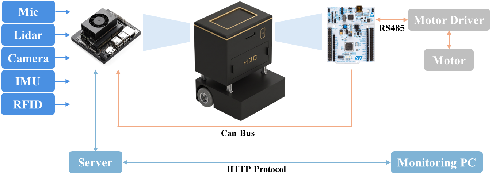

# H3C Robotics

  <b>Physical Security Mobile Robot System</b> 
  Robotics · Perception · Navigation · Monitoring

  

  실내 보안 순찰을 위한 모바일 로봇 통합 시스템입니다. 
  하드웨어, SLAM/Navigation, Vision, Audio Event Detection, 
  Backend Server, GUI Frontend를 통합하여 
  로봇 기반 보안 관제 기능을 제공합니다.

---

## 👥 Team Members

| Name | Role | Contact |
|---|---|---|
| 추성현 | Hardware Design / Electrical / Audio Event Detection | hyeon020228@gmail.com |
| 김예찬 | SLAM / Navigation | jack4842@gmail.com |
| 황일겸 | GUI Frontend / UI Design | luceinaltis0509@gmail.com |
| 최수현 | Vision / Backend Server | chsuk02@hanyang.ac.kr |

---

## 📌 Featured Repository

| Repository | Description |
|---|---|
| [capston_h3c_integration](https://github.com/H3cRobotics/capston_h3c_integration) | ROS 2 기반 로봇 통합 레포지토리. 로봇 통신, Robot GUI, Vision, Audio 인지 기능 통합 |
| [capston_patrol_server](https://github.com/H3cRobotics/capston_patrol_server) | 관제 서버 레포지토리. Backend Server, 이벤트 DB, API, Flutter Web GUI, 실시간 모니터링 기능 제공 |

---

